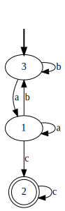

# Pythomata


[](https://pypi.python.org/pypi/pythomata)
[](https://travis-ci.org/whitemech/pythomata)
[](https://pypi.python.org/pypi/pythomata)
[](https://www.mkdocs.org/)
[](https://img.shields.io/badge/status-development-orange.svg)
[](https://coveralls.io/github/whitemech/pythomata?branch=master)
[](https://img.shields.io/badge/flake8-checked-blueviolet)
[](https://img.shields.io/badge/mypy-checked-blue)
[](https://img.shields.io/badge/license-Apache%202-lightgrey)

Python implementation of automata theory.


* Free software: Apache 2.0
* Documentation: https://whitemech.github.io/pythomata.

## Install

- from [PyPI](https://pypi.org/project/pythomata/):

      pip install pythomata
      pip install pythomata=0.3.0a  # for the pre-release.

- or, from source (`master` branch):

      pip install git+https://github.com/whitemech/pythomata.git


- or, clone the repository and install:

      git clone htts://github.com/whitemech/pythomata.git
      cd pythomata
      pip install .


## How to use

* Define an automaton:

```python
from pythomata import SimpleDFA
alphabet = {"a", "b", "c"}
states = {"s1", "s2", "s3"}
initial_state = "s1"
accepting_states = {"s3"}
transition_function = {
    "s1": {
        "b" : "s1",
        "a" : "s2"
    },
    "s2": {
        "a" : "s3",
        "b" : "s1"
    },
    "s3":{
        "c" : "s3"
    }
}
dfa = SimpleDFA(states, alphabet, initial_state, accepting_states, transition_function)
```

* Test word acceptance:

```python
# a word is a list of symbols
word = "bbbac"
dfa.accepts(word)        # True

# without the last symbol c, the final state is not reached
dfa.accepts(word[:-1])   # False
```

* Operations such as minimization and trimming:

```python
dfa_minimized = dfa.minimize()
dfa_trimmed = dfa.trim()
```

* Translate into a [`graphviz.Digraph`](https://graphviz.readthedocs.io/en/stable/api.html#graphviz.Digraph)
  instance:

```python
graph = dfa.minimize().trim().to_graphviz()
```

To print the automaton:
```
graph.render("path_to_file.svg")
```

For that you will need to install Graphviz.
Please look at their [download page](https://graphviz.gitlab.io/download/)
for detailed instructions depending on your system.

The output looks like the following:

<p align="center">
  
</p>


## Features


* Basic DFA and NFA support;
* Algorithms for DFA minimization and trimming;
* Algorithm for NFA determinization;
* Translate automata into Graphviz objects.


## Tests

To run the tests:

    tox

To run only the code style checks:

    tox -e flake8

## Docs

To build the docs:


    mkdocs build


To view documentation in a browser


    mkdocs serve


and then go to [http://localhost:8000](http://localhost:8000)


## License

Copyright 2018-2020 [WhiteMech](https://whitemech.github.io)

