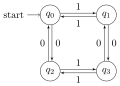

# Quickstart
This guide will show you some
examples of use of the package.


## Formal definition of an automaton

Formally, a (deterministic finite) automaton $\mathcal{A}$
(DFA, see Chapter 2 of [1]) is defined as:

$$\mathcal{A} = \langle Q, \Sigma, q_0, F, \delta\rangle$$

Where:

- $Q$ is the (non-empty) finite set of states;
- $\Sigma$ is the set of symbols;
- $q_0 \in Q$ is the initial state:
- $F \subseteq Q$ is the set of accepting states;
- $\delta: Q \times \Sigma \to Q$ is the transition function.


## Example: even number of 0's and 1's

Let's design a (deterministic) finite
 automaton that consider the following language:

> _All the binary strings such that_
> _they have an even number of 0's and 1's._

An automaton that accepts that language is the following:

<p align="center">
  
</p>

in particular:

- the set of states $q = \{q_0, q_1, q_2, q_3\}$
- the alphabet $\sigma = \{0, 1\}$
- the initial state $q_0$
- the set of accepting states $F = \{q_0\}$
- the transition $\delta$ defined as follows:
    - for $q_0$: $\delta(q_0, 0) = q_2$ and $\delta(q_0, 1) = q_1$
    - for $q_1$: $\delta(q_1, 0) = q_3$ and $\delta(q_1, 1) = q_0$
    - for $q_2$: $\delta(q_2, 0) = q_0$ and $\delta(q_2, 1) = q_3$
    - for $q_3$: $\delta(q_3, 0) = q_2$ and $\delta(q_3, 1) = q_1$

## Using Pythomata

The definition in Pythomata is straightforward, since there's
a one-to-one mapping to code.

the set of states $Q$:

```python
states = {"q0", "q1", "q2", "q3"}
```

the alphabet $\sigma$ (i.e. a set of symbols):

```python
alphabet = {"0", "1"}
```

the initial state $q_0$:

```python
initial_state = "q0"
```

the set of accepting states $F$:

```python
accepting_states = {"q0"}
```

the transition function $\delta$ is defined as a nested dictionary:

```python
transition_function = {
    "q0": {
        "0": "q2",
        "1": "q1",
    },
    "q1": {
        "0": "q3",
        "1": "q0",
    },
    "q2": {
        "0": "q0",
        "1": "q3",
    },
    "q3": {
        "0": "q1",
        "1": "q2",
    }
}
```


Now we can instantiate a `SimpleDFA` object:

```python
automaton = SimpleDFA(
    states=states,
    alphabet=alphabet,
    initial_state=initial_state,
    accepting_states=accepting_states,
    transition_function=transition_function,
)

```

We can inspect the structure of the automaton:

```python
automaton.states
# {"q0", "q1", "q2", "q3"}
automaton.initial_state
# "q0"
automaton.accepting_states
# {'q0'}
automaton.get_transitions()
"""
{('q0', '0', 'q2'),
 ('q0', '1', 'q1'),
 ('q1', '0', 'q3'),
 ('q1', '1', 'q0'),
 ('q2', '0', 'q0'),
 ('q2', '1', 'q3'),
 ('q3', '0', 'q1'),
 ('q3', '1', 'q2')}
"""
```

The attribute `automaton.alphabet` is an instance of
the `Alphabet` class.

```python
automaton.alphabet.size
# 2
list(automaton.alphabet)
# ['0', '1']
```

Now we can check word membership with the `accepts` method:

```python
automaton.accepts("")         # True
automaton.accepts("0")        # False - only one '0'
automaton.accepts("1")        # False - only one '1'
automaton.accepts("00")       # True
automaton.accepts("11")       # True
automaton.accepts("01" * 42)  # True
```

### Rendering

Pythomata lets you render the automata by using
the `graphviz` package. Please check
the [installation section](https://github.com/xflr6/graphviz#installation)
to know what you need to install.


Assuming you executed the previous code:
```python
digraph = automaton.to_graphviz()
# Now `digraph` is a `graphviz.dot.Digraph` object.
digraph.render("my-even-01-automaton")
```

Check your current working directory, you should find
a file called `my-even-01-automaton.svg`:

<p align="center">
  
</p>
